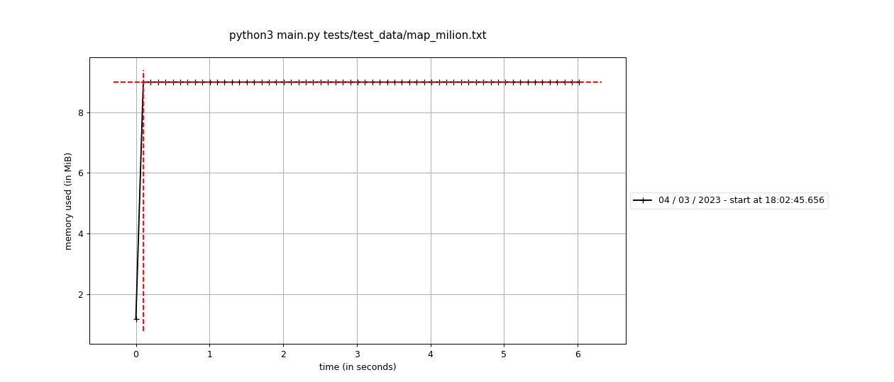
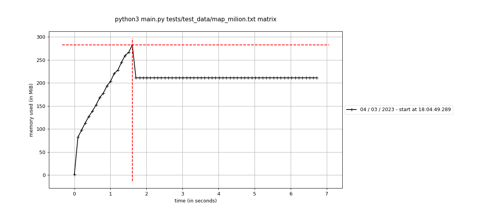
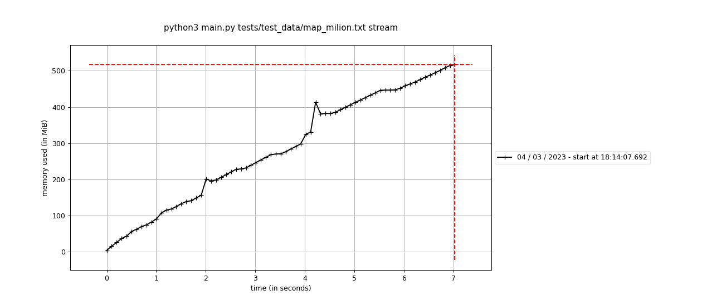
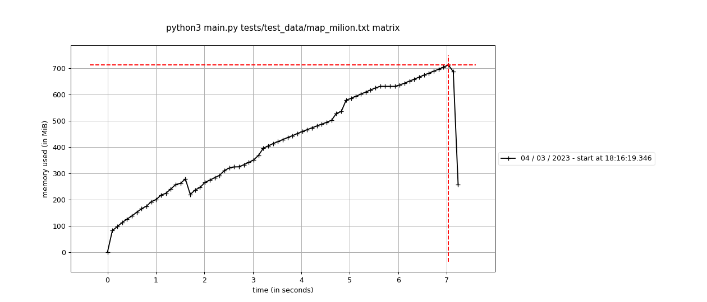
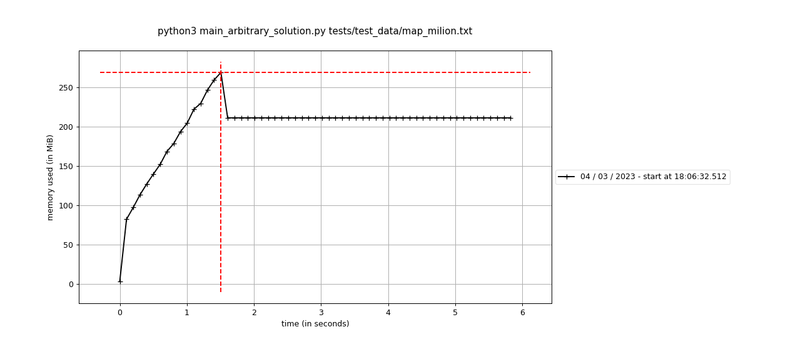

# Islands Explorer

## How to run commads

1. By invoking `run.sh` script with path to map:
```commandline
$ ./run.sh tests/test_data/map.txt
4
```

Without providing path you will get a notification:
```
$ ./run.sh
Provide path to the file with the map
```

2. In the docker container:

- build docker image (run only once)
```commandline
docker build -t explorer .
```
- run commands with the prefix: `docker run --rm -it explorer`
```commandline
docker run --rm -it explorer python3 main.py tests/test_data/map_milion.txt
```

3. By running Makefile comands (local):

- `make` is running tests
```commandline
$ make
python3 -m unittest tests/test_*.py
..s.....................
----------------------------------------------------------------------
Ran 24 tests in 22.676s

OK (skipped=1)
```
- `make stream` the most efficient way of exploring data with my algorithm `Explorer`
```commandline
$ make stream
bash run.sh tests/test_data/map_milion.txt stream --debug
Finished in 8.146579368971288 seconds, method: stream, file: tests/test_data/map_milion.txt
516096
```
- `make matrix` - calls the `Explorer` algorithm, data is not streamed directly from the file, but first loaded into memory.
- `make graph` - calls a reference agorithm on the basis of graphs - it is used to validate results obtained with `Explorer`.

4. Directly with `python`:
```commandline
python3 main.py tests/test_data/map_milion.txt
```

5. Other examples:
```commandline
mprof run python3 main.py tests/test_data/map_milion.txt
mprof run python3 main.py tests/test_data/map_milion.txt stream --debug
mprof run python3 main.py tests/test_data/map_milion.txt matrix --debug
mprof run python3 main_arbitrary_solution.py tests/test_data/map_milion.txt graph --debug
docker run --rm -v .:/app -it explorer mprof run python3 main.py tests/test_data/map_milion.txt --debug
docker run --rm -v .:/app -it explorer mprof plot -o image.png
```

## Solution description

The algorithm simulates an explorer who moves around the map from left to right.
It records whether each encountered position is a new land and has neighbors.

The islands are described in two dictionaries: `positions` and `lands`.
The `positions` dictionary contains information about the position and which island it belongs to.

In the `lands` dictionary there is information about what positions the island consists of.

Let's take a simple example of a map:

```
101
100
```

The explorer who is in position `(1,2)`, i.e. in the lower right corner, will have:

- `poistions`:
```
{
(0, 0): "0-0",
(0, 2): "0-2",
(1, 0): "0-0"
}
```

This means that the position `(0, 0)` belongs to the land called `0-0'`, the position `(0, 2)` belongs to the land called `0-2'`
and the position `(1, 0)` belongs to the land called `0-0'`.

- `lands`:
```
{
'0-0': [(0, 0), (1, 0)],
'0-2': [(0, 2)]
}
```
This describes that the island named `'0-0'` consists of the positions `(0, 0)` and `(1, 0)`, and the island `'0-2'` consists of the positions `(0, 2)`.

It is enough to count how many lands (keys) are in the `lands` dictionary to get the result.


### Algorithm steps


The algorithm consists of the following steps:
1. Explore the position
- if there are neighbours next to the current position, then the name is taken from the first neigbour.
  The position with the same name as a neighbor becomes part of the adjacent land.
- if there is no neighbours, then name is based on coordinates, like `0-0`.
- information about the position and name of the land is saved in the appropriate dictionaries.
2. Connecting neighbors
- changing the names of neighboring lands to the name of the current position.
  Considered neighbours to be connected are lands next to the explored position.
  First land is with the position behind the explorer. Next lands may start with the posistion above the explorer (2, 3, 4).
  Neighbour lands are connected in the clockwise order. When lands are conneced then they have the same name.
  Current position: `(1,1)`
```
  2 3 4        1 1 1
  1 1     ->   1 1
```
Renaming the first neighbour can be skipped because the current name is derived from it.
- positions of neighbours land extend list of the current land positions,
- empty lands (without positions) are removed for dictionary `lands`.

3. Counting islands beyond the horizon (optional step for memory efficiency).

  Current position: `(2,6)`
```
   xxxxxxxxx <- previous lands data is not needed
   101100100
   111000100
         ^- current position
```
It is not necessary to keep information about all positions of lands already visited. Keeping them in dictionaries will result in too many data updates.

The explorer, moving from left to right, explores only neighboring positions and connects neighbors around.
If a given position is not directly adjacent to discovered positions, information about these positions can be removed.
Positions are also removed from the lists in the land dictionary.

If a given land points to an empty positions list, it can also be removed from the `lands` dictionary.
Each key removed from the `land` dictionary must be counted.
4. Islands stored in the `lands` dictionary must be counted and added to the `lands_beyond_horizon` from step 3.

## Memory profiling

Starting the program in the standard configuration allows for the analysis of very large maps.
I used the `mprof` tool to generate the presented graphs.

```commandline
 mprof run python3 main.py tests/test_data/map_milion.txt
 mprof plot
```

I tested the algorithm on a dataset with over a million rows and nine columns (1030144 x 9).
I ran tests for the following scenarios.

1. Reading map data from a file, character by character, and calculating the result on the fly.



2. Loading the whole map into memory and analyze it character by character using the same algorithm as in the first scenario.



3. I also ran the above scenarios without optimizing the algorithm's memory.
More precisely, without removing unnecessary elements for further processing of data from the map.

- Streaming data direcly from the file.



- Streaming of data from a previously loaded two-dimensional matrix.




4. I also compared my solution with the graph based solution (taken from: https://www.geeksforgeeks.org/find-the-number-of-islands-using-dfs/)
     This algorithm is used as an arbitrary solution to see if mine produces the same result for a common set of tests.




## Summary

I spent about 2 hours coming up with this algorithm.
It took me much longer to write tests (TDD of course!), refactor the code and play around with memory profiling.
I'm being a bit too scientific in my approach, but I hope you like my solution.

And the results are quite surprising.

1. The algorithm I implemented runs comparably fast as graph-based solutions, and uses much less memory.
I achived this by processing data in the fly, when streaming it from the file.
Graph based algorithms need to have the whole map loaded into the memory, which is a disadvantage where it comes to handling huge data or specific ones (like `one big island`).

2. The recursion-based algorithm fails when encountering cases leading to a "RecursionError".

For example, a graph-based solution cannot cope with a filled matrix, i.e. with one large 25x40 or 10x120 island.
(Unit tests fail for maps no. 12 and 14)

```code
           Error: `RecursionError: maximum recursion depth exceeded in comparison.`
```

3. At the last one, but not least. I have refactored the code to be more object oriented.
That has caused small drop in efficiency, but the code is easy to read and understood.


### What's left to improve

I cover the logic with tests based on different maps and a reference solution for a common set of tests.
More unit tests would be good to add.
I was working in my virtual environment and the script has no external dependencies.
Only Python 3 is needed to run it.

- [x] invent an algorithm
- [x] add tests (testing logic)
- [x] add script `./run.sh <path_to_the_file>`
- [x] add arbitrary solution
- [x] profiling
- [x] check coverage
- [x] refactoring
- [x] descriptions
- [x] docker file
